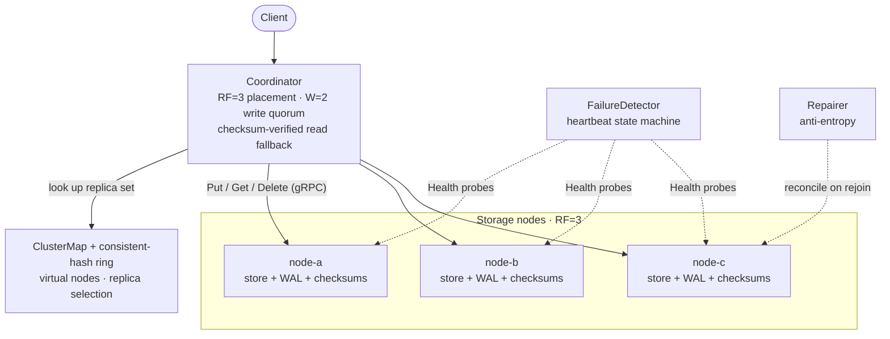

# Distributed Object Store

A fault-tolerant distributed object storage system in C++20 — built systems-first
to demonstrate concurrency, storage durability, distributed coordination, and
performance engineering.

> **Status:** Milestones 0–7 complete — the CORE tier. A concurrent single-node
> storage engine (checksums, atomic durable writes, versioning, SQLite metadata,
> bounded-queue thread pool, sharded locking — TSan-clean), a consistent-hash
> **placement** layer, **replication over gRPC** (RF=3 / W=2 quorum,
> checksum-verified read fallback), **conditional, idempotent writes**
> (`expected_version` → `CONFLICT`, `request_id` dedup), **failure detection +
> anti-entropy repair** (heartbeat state machine; a rejoining node is repaired
> back to full redundancy), and a **write-ahead log with crash recovery**
> (interrupted writes are completed or discarded on restart), a **metadata /
> control-plane split** (placement and the object→replica map live behind a
> `Metadata` gRPC service; payloads never touch it), and an **HTTP gateway + CLI
> + LRU metadata cache** — the whole cluster is usable over `curl` — and
> **observability** (structured JSON logs with request IDs, Prometheus
> `/metrics`, Grafana dashboard), and a **one-command Docker Compose stack**
> (nodes + metadata + gateway + Prometheus + Grafana). Kubernetes is next.

## See it fail over

A client `PUT`, a node killed mid-flight, a `GET` that still succeeds from a
surviving replica, then anti-entropy repair restoring full redundancy on rejoin
— end to end (`./build/cluster_demo`):


## Architecture

Control plane (placement/metadata) is kept separate from the data plane (object
bytes): metadata answers *"where and which version?"*, storage nodes answer
*"give me the bytes."*



Each node: filesystem object store + per-key sharded locks + SQLite metadata +
write-ahead log + SHA-256 integrity. See [docs/architecture.md](docs/architecture.md).

## What works today

- **`ObjectStore`** contract: `PUT` / `GET` / `HEAD` / `DELETE` / `LIST`.
- **`LocalObjectStore`**: filesystem-backed store with an atomic, fsync'd write
  path — a partially written object is never observable as committed.
- **Integrity**: every object carries a SHA-256 checksum, verified on read;
  corruption is detected, not served.
- **Versioning**: monotonic per-key versions; delete is a tombstone.
- **Metadata**: SQLite (`objects` table) behind a `MetadataStore` interface, the
  seam for the future control/data-plane split.
- **Concurrency**: fixed-size `ThreadPool` with a bounded queue (overload →
  `kUnavailable`, no unbounded growth) and **sharded locking** on the object
  store (exclusive for writes, shared for reads). ThreadSanitizer-clean.
- **Placement**: 64-bit **consistent-hash ring** with virtual nodes and a
  `ClusterMap`; deterministic key→node mapping and replica selection. Adding a
  node moves only ~1/N of keys (measured: 25% vs modulo's 75% going 3→4 nodes).
- **Replication over gRPC**: `dos_node` storage-node processes serving a
  `StorageNode` service; a `Coordinator` writes to the RF=3 replica set with a
  W=2 **write quorum**, reads with **checksum-verified fallback** across
  replicas, and tracks replica health. Survives a single node down; fails a
  write cleanly when quorum is unreachable.
- **Conditional & idempotent writes**: `PutConditional` enforces an
  `expected_version` (stale writers get `CONFLICT`, deterministically) and dedups
  retries by `request_id`, so a client timeout-and-retry never creates a second
  contradictory version. Concurrent writers on the same version → exactly one wins.
- **Failure detection & repair**: a `FailureDetector` heartbeat state machine
  (`Healthy → Suspect → Unavailable → Recovering → Healthy`, with a miss
  threshold so transient blips don't declare a node dead) and a `Repairer` that
  reconciles a rejoining node from healthy peers — checksum-verified — back to
  full redundancy.
- **Write-ahead log + crash recovery**: every mutation is logged (CRC32-checked,
  fsync'd) before it becomes visible; on restart, interrupted writes are
  completed (if the payload is durable and intact) or discarded — idempotently.
  A torn WAL tail is detected and ignored.
- **Control/data-plane split**: a `Metadata` gRPC service owns cluster
  membership, consistent-hash placement, and the object→replica-set map behind a
  `MetadataView` interface. The coordinator asks *where* to write, writes bytes
  to storage nodes under a quorum, and registers the replica set back — **object
  payloads never pass through the metadata service** (its records carry version,
  checksum, size, and replica ids only).
- **HTTP gateway, CLI & cache**: a thin HTTP/1.1 gateway (`dos_gateway`) exposes
  `PUT/GET/HEAD/DELETE/LIST` over `/objects/<key>` — usable from `dos_cli` or
  plain `curl` — with gRPC-`Status`→HTTP-code mapping. Reads flow through an O(1)
  **LRU metadata cache** kept coherent on writes.
- **Observability**: a per-request **request id** (returned as `X-Request-Id`,
  logged in structured JSON with latency) for end-to-end tracing, and a
  Prometheus **`/metrics`** endpoint (request/error counters, latency histograms,
  cache hit ratio, replica state) with a ready-to-import Grafana dashboard.

## Build & test

Requires a C++20 compiler, CMake ≥ 3.20, Ninja, GoogleTest, SQLite3, gRPC +
Protobuf, and pkg-config.

```sh
# macOS deps
brew install cmake ninja pkgconf googletest sqlite grpc protobuf

cmake -S . -B build -G Ninja -DDOS_WERROR=ON
cmake --build build
ctest --test-dir build --output-on-failure
```

Run under a sanitizer (ThreadSanitizer shown; also `address`, `undefined`):

```sh
cmake -S . -B build-tsan -G Ninja -DDOS_SANITIZER=thread
cmake --build build-tsan
ctest --test-dir build-tsan --output-on-failure
```

### Try it

```sh
./build/storage_demo /tmp/dos-demo
```

```
PUT   key=greeting/hello.txt version=1 size=24 sha256=9e3697...
GET   24 bytes: "hello, distributed world"
      byte-identical? yes
HEAD  version=1 deleted=0
LIST  1 object(s)
DELETE then GET -> NOT_FOUND: tombstoned: greeting/hello.txt (expected NOT_FOUND)
OK
```

See [Benchmarks](#benchmarks) below for the rebalancing and throughput numbers
(`./build/rebalance_bench`, `./build/micro_bench`).

Run a three-node cluster as separate processes:

```sh
./build/dos_node --id node-a --address 127.0.0.1:9101 --data-dir /tmp/dos/a &
./build/dos_node --id node-b --address 127.0.0.1:9102 --data-dir /tmp/dos/b &
./build/dos_node --id node-c --address 127.0.0.1:9103 --data-dir /tmp/dos/c &
```

The `Coordinator` fans writes across the replica set and serves reads with
checksum-verified fallback (see [docs/protocol.md](docs/protocol.md)); the
end-to-end quorum and failover behavior is exercised in
`tests/integration/replication_test.cc`.

Or drive the whole stack over HTTP — start the metadata service, nodes, and
gateway (see [docs/gateway.md](docs/gateway.md)), then:

```sh
curl -X PUT --data-binary "hello" http://127.0.0.1:8080/objects/greeting
curl http://127.0.0.1:8080/objects/greeting        # -> hello
curl http://127.0.0.1:8080/objects                 # -> JSON listing
./build/dos_cli --gateway 127.0.0.1:8080 delete greeting
```

## Run the whole stack (Docker Compose)

One command brings up the three storage nodes (with durable volumes), the
metadata service, the gateway, and Prometheus + Grafana:

```sh
docker compose -f deploy/compose/docker-compose.yml up --build
# gateway  http://localhost:8080   ·  Prometheus http://localhost:9090
# Grafana  http://localhost:3000/d/dos-overview   (anonymous viewer)
```

Objects survive an intended container restart (per-node Docker volumes), and
Prometheus auto-scrapes the gateway. See [docs/deployment.md](docs/deployment.md)
for the clean-start / clean-reset commands.

## Benchmarks

> Reproduced on an **Apple M1 Pro (8 cores), 16 GB, macOS 26** with the exact
> commands shown. Numbers are illustrative of this machine; rerun locally rather
> than quoting these verbatim. (The evidence rule: no number goes in a résumé
> until it's reproducible from a documented command with stated hardware.)

**Consistent-hash rebalancing** — growing the cluster 3 → 4 nodes
(`./build/rebalance_bench`, 100k keys, 200 vnodes):

| Scheme | Distribution across 3 nodes | Keys moved adding a 4th |
|--------|-----------------------------|-------------------------|
| Consistent hashing | 32.3% / 33.5% / 34.2% | **25.25%** (≈ ideal 1/N) |
| Modulo `hash % N`  | — | 74.99% |

→ consistent hashing moves **~3× fewer keys**, and every moved key goes *only*
to the new node (asserted in tests).

**Single-node throughput & latency** — durable (fsync'd) writes, single thread,
warm cache (`./build/micro_bench 500`):

| Object size | Op  | ops/s | MB/s | p50 | p95 | p99 |
|-------------|-----|------:|-----:|----:|----:|----:|
| 4 KB   | PUT | 1,136 |  4.4 |  0.72 ms |  0.90 ms |  1.21 ms |
| 4 KB   | GET | 6,139 | 24.0 |  0.16 ms |  0.18 ms |  0.21 ms |
| 64 KB  | PUT |   580 | 36.3 |  1.60 ms |  2.03 ms |  2.38 ms |
| 64 KB  | GET |   754 | 47.1 |  1.28 ms |  1.51 ms |  1.60 ms |
| 1 MB   | PUT |    85 | 85.1 | 11.9 ms  | 14.0 ms  | 14.5 ms  |
| 1 MB   | GET |    54 | 54.3 | 17.1 ms  | 23.4 ms  | 28.2 ms  |

**Bottleneck identified:** for small objects PUT latency is dominated by the
durability path (WAL `fsync` + object `fsync` + directory `fsync`). For large
objects, *GET* becomes the slower op because every read **re-verifies the
SHA-256 checksum** over the whole payload, and the checksum is a portable,
unoptimized reference implementation — hashing, not I/O, dominates 1 MB reads.
Both are deliberate correctness costs (durability, integrity), and both are
clear optimization targets (batch/group-commit; a hardware-accelerated hash).

## Layout

```
proto/    storage.proto (StorageNode) · metadata.proto (Metadata control plane)
include/  common/ (status, sha256, hash, digest, thread_pool, lru_cache,
                    metrics, logging)
          cluster/ (consistent_hash_ring, cluster_map, failure_detector,
                    metadata_view, metadata_repository, caching_metadata_view)
          storage/ (object_store, local_object_store, sqlite_metadata_store, wal)
          network/ (storage_node_*, metadata_*, coordinator, repairer,
                    http_server/client, http_gateway)
src/      implementations mirroring include/
tests/    unit/ (GoogleTest) · integration/ (in-process gRPC cluster + gateway)
tools/    demo/ · node/ (dos_node) · metadata/ (dos_metadata)
          gateway/ (dos_gateway) · cli/ (dos_cli) · bench/ · clusterbench/
deploy/   docker/ (Dockerfile) · compose/ (docker-compose.yml)
          prometheus/ · grafana/ (provisioning + dashboard)
docs/     architecture, storage-engine, consistency, protocol, failure-model
```

## Documentation

- [Architecture](docs/architecture.md) — components and target topology.
- [Storage engine](docs/storage-engine.md) — durability contract and exact
  crash behavior at each PUT boundary.
- [Placement & consistency](docs/consistency.md) — consistent hashing, virtual
  nodes, rebalancing.
- [Protocol & replication](docs/protocol.md) — gRPC contract, quorum, conditional
  & idempotent writes, consistency model.
- [Failure model](docs/failure-model.md) — heartbeat detection and anti-entropy
  repair.
- [Gateway, CLI & cache](docs/gateway.md) — HTTP API, `dos_cli`, LRU metadata
  cache.
- [Observability](docs/observability.md) — request IDs, structured logs,
  Prometheus metrics, Grafana.
- [Deployment](docs/deployment.md) — one-command Docker Compose stack.

## Roadmap

| Milestone | Focus |
|-----------|-------|
| ✅ M0 | Build/test foundation (CMake, CI, GoogleTest, clang-format) |
| ✅ M1 | Single-node storage engine (checksums, atomic writes, versioning) |
| ✅ M2 | Concurrency: thread pool, bounded queue, sharded locks (TSan-clean) |
| ✅ M3 | Consistent-hash ring + virtual nodes + cluster map (placement) |
| ✅ M4 | Replication over gRPC: RF=3, W=2 quorum, checksum-verified read fallback |
| ✅ M5 | Versioning & idempotency (conditional PUT → CONFLICT, request-id dedup) |
| ✅ M6 | Failure detection (heartbeat FSM) + anti-entropy replica repair |
| ✅ M7 | Write-ahead log + crash recovery (interrupted writes completed/discarded) |
| ✅ M8 | Metadata / control-plane split (placement + object→replica map behind a gRPC service) |
| ✅ M9 | HTTP gateway + CLI + O(1) LRU metadata cache |
| ✅ M10 | Observability: request IDs, JSON logs, Prometheus `/metrics`, Grafana |
| ✅ M11 | Docker Compose: one-command cluster + Prometheus + Grafana |
| M12 | Kubernetes (kind) |
| M13 | Performance engineering + benchmarks |
| M14 | Failure & chaos testing |
| M15 | (Optional) Raft metadata coordination |

## License

MIT — see [LICENSE](LICENSE).
