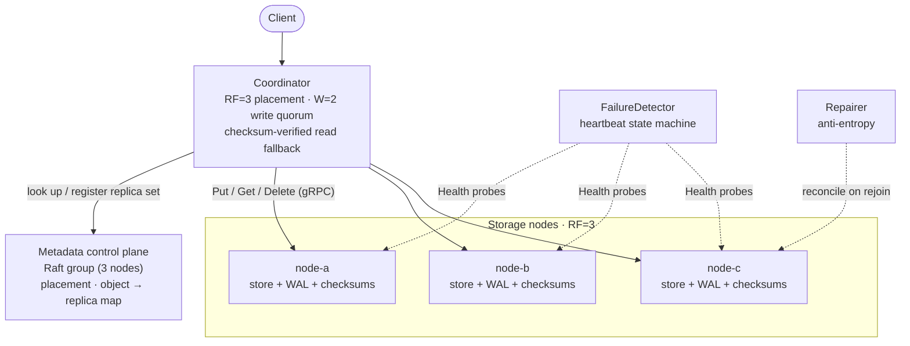

# Distributed Object Store

A fault-tolerant distributed object store written in C++20: three-node
replication with quorum writes, per-object durability and crash recovery, and a
Raft-coordinated control plane.

[](https://github.com/snehalgore1/distributed-object-storage/actions/workflows/ci.yml)


[](LICENSE)

By Snehal Gore.

I built this to go deep on the parts of systems programming that a typical
application job never really touches: concurrency, replication, on-disk
durability, failure handling, and distributed consensus. Rather than a wide
feature set, the goal was a small system whose hard problems are the interesting
ones, built up in reviewable milestones and backed by tests at every step.

## What this demonstrates

| Area | What's here |
|------|-------------|
| Language / tooling | C++20, CMake + Ninja, GoogleTest, clang-format/clang-tidy, GitHub Actions CI |
| Concurrency | Fixed thread pool with a bounded queue, per-key sharded locking, ThreadSanitizer-clean |
| Distributed data | Consistent-hash placement, gRPC replication (RF=3), W=2 write quorum, checksum-verified reads |
| Durability | Atomic fsync'd writes, SHA-256 integrity, a write-ahead log, crash recovery |
| Consensus | Raft for the metadata control plane: leader election with pre-vote, a disk-persisted log, and failover |
| Operations | HTTP gateway + CLI, request-id tracing, Prometheus metrics, Grafana, Docker Compose, Kubernetes |

131 unit and integration tests, a ThreadSanitizer job on every push, and
benchmarks you can reproduce from the commands below.

## See it fail over

A client `PUT`, a node killed mid-flight, a `GET` that still succeeds from a
surviving replica, then anti-entropy repair restoring full redundancy when the
node rejoins:


## Highlights

Each item links to the design doc that goes deeper.

- **Storage engine**: a filesystem-backed store with an atomic, fsync'd write
  path (a half-written object is never visible as committed), SHA-256 verified on
  every read, and monotonic per-key versions with tombstone deletes.
  [storage-engine.md](docs/storage-engine.md)
- **Concurrency**: a fixed-size thread pool with a bounded queue (overload is
  rejected as `UNAVAILABLE` instead of growing without limit) and sharded
  read/write locks on the store. Clean under ThreadSanitizer.
- **Placement**: a 64-bit consistent-hash ring with virtual nodes. Adding a
  node moves only about 1/N of keys instead of most of them.
  [consistency.md](docs/consistency.md)
- **Replication**: `dos_node` storage processes behind a gRPC `StorageNode`
  service, with a coordinator that writes to the RF=3 replica set under a W=2
  quorum and reads with checksum-verified fallback across replicas. Conditional
  and idempotent writes (`expected_version`, `request_id`) make retries safe.
  [protocol.md](docs/protocol.md)
- **Durability and repair**: every mutation goes through a CRC32-checked,
  fsync'd write-ahead log before it's visible, so an interrupted write is
  completed or discarded on restart. A heartbeat failure detector and an
  anti-entropy repairer bring a rejoining node back to full redundancy.
  [failure-model.md](docs/failure-model.md)
- **Operability**: an HTTP/1.1 gateway and CLI over `/objects/<key>`, an O(1)
  LRU metadata cache, per-request ids in structured JSON logs, and a Prometheus
  `/metrics` endpoint with a Grafana dashboard.
  [gateway.md](docs/gateway.md), [observability.md](docs/observability.md)
- **Raft-coordinated metadata**: the control plane (membership, placement, the
  object-to-replica map) runs as a three-node Raft group: leader election with
  pre-vote, a disk-persisted replicated log, majority commit, follower catch-up,
  and leader failover. It is no longer a single point of failure, and a write
  that reaches a follower is forwarded to the leader.
  [consensus.md](docs/consensus.md)
- **Packaging**: a one-command Docker Compose stack (nodes, metadata, gateway,
  Prometheus, Grafana) and Kubernetes manifests validated on kind.
  [deployment.md](docs/deployment.md)

## Quick start

The fastest way to see the whole thing running is Docker Compose. It brings up
three storage nodes with durable volumes, the metadata service, the gateway, and
Prometheus + Grafana:

```sh
docker compose -f deploy/compose/docker-compose.yml up --build
```

Then use it over HTTP:

```sh
curl -X PUT --data-binary "hello" http://localhost:8080/objects/greeting
curl http://localhost:8080/objects/greeting     # -> hello
curl http://localhost:8080/objects              # -> JSON listing
```

Grafana is at `http://localhost:3000/d/dos-overview` (anonymous viewer) and
Prometheus at `http://localhost:9090`.

### Build from source

Needs a C++20 compiler, CMake >= 3.20, Ninja, GoogleTest, SQLite3, gRPC +
Protobuf, and pkg-config.

```sh
brew install cmake ninja pkgconf googletest sqlite grpc protobuf   # macOS

cmake -S . -B build -G Ninja -DDOS_WERROR=ON
cmake --build build
ctest --test-dir build --output-on-failure
```

To run under a sanitizer (also `address`, `undefined`):

```sh
cmake -S . -B build-tsan -G Ninja -DDOS_SANITIZER=thread
cmake --build build-tsan
ctest --test-dir build-tsan --output-on-failure
```

A single-process smoke test of the storage engine:

```sh
./build/storage_demo /tmp/dos-demo
```

To run the pieces as separate processes (three storage nodes, the metadata
service, and the gateway), see [gateway.md](docs/gateway.md). For a live
Raft leader-election and failover demo, see
[consensus.md](docs/consensus.md) and `tools/demo/raft_cluster_demo.sh`.

## Architecture

The control plane and the data plane are kept separate. The metadata service
answers "where does this key live, and at what version?" and the storage nodes
move the bytes. Metadata is replicated with Raft; object payloads never pass
through it.



Each node is a filesystem object store with per-key sharded locks, SQLite
metadata, a write-ahead log, and SHA-256 integrity. More in
[architecture.md](docs/architecture.md).

## Benchmarks

I measured these on an Apple M1 Pro (8 cores, 16 GB, macOS) with the commands
shown. They describe this machine, so rerun them locally rather than trusting the
exact figures.

**Consistent-hash rebalancing**, growing the cluster from 3 to 4 nodes
(`./build/rebalance_bench`, 100k keys, 200 virtual nodes):

| Scheme | Distribution across 3 nodes | Keys moved adding a 4th |
|--------|-----------------------------|-------------------------|
| Consistent hashing | 32.3% / 33.5% / 34.2% | **25.25%** (about the ideal 1/N) |
| Modulo `hash % N`  | — | 74.99% |

Consistent hashing moves roughly 3x fewer keys, and every moved key goes only to
the new node (asserted in the tests).

**Distributed load test** (`./build/loadgen` against the running cluster, RF=3,
4 KB objects, 80% reads). Throughput scales and then saturates, and each row
changes one variable at a time. Full tables are in
[benchmarks.md](docs/benchmarks.md):

| Change | Result |
|--------|--------|
| 1 to 8 client threads | 1.5k to 3.8k req/s, then plateaus near 3.8k as latency climbs |
| RF=1 to RF=3 (writes) | throughput roughly halves (2.5k to 1.3k req/s) |
| metadata cache off to on (hot reads) | about +30% throughput, -23% p50 latency |

Single-node numbers (`./build/micro_bench 500`, durable writes, warm cache) for
reference, with the full size sweep in [benchmarks.md](docs/benchmarks.md):

| Object size | Op  | ops/s | p95 |
|-------------|-----|------:|----:|
| 4 KB | PUT | 1,136 | 0.90 ms |
| 4 KB | GET | 6,139 | 0.18 ms |
| 1 MB | PUT | 85 | 14.0 ms |

The bottleneck I found: for small objects, PUT latency is dominated by the
durability path (WAL fsync plus object fsync plus directory fsync). For large
objects, GET is the slower op because each read re-verifies the SHA-256 checksum
over the whole payload with a portable reference implementation, so hashing
rather than I/O dominates a 1 MB read. Both are correctness costs I chose on
purpose, and both are clear optimization targets (group commit, a
hardware-accelerated hash).

## Design docs

- [Architecture](docs/architecture.md): components and topology.
- [Storage engine](docs/storage-engine.md): the durability contract and exact
  crash behavior at each write boundary.
- [Placement and consistency](docs/consistency.md): consistent hashing, virtual
  nodes, rebalancing.
- [Protocol and replication](docs/protocol.md): gRPC contract, quorum,
  conditional and idempotent writes.
- [Failure model](docs/failure-model.md): heartbeat detection and anti-entropy
  repair.
- [Consensus](docs/consensus.md): Raft leader election, pre-vote, the persisted
  log, and failover.
- [Gateway, CLI and cache](docs/gateway.md): the HTTP API, `dos_cli`, and the
  LRU metadata cache.
- [Observability](docs/observability.md): request ids, structured logs,
  Prometheus, Grafana.
- [Deployment](docs/deployment.md): Docker Compose and Kubernetes.
- [Benchmarks](docs/benchmarks.md): the load generator and the full result
  tables.

## Repository layout

```
proto/    storage.proto (StorageNode) · metadata.proto · raft.proto
include/  common/ · cluster/ · storage/ · network/ · consensus/
src/      implementations mirroring include/
tests/    unit/ (GoogleTest) · integration/ (in-process gRPC cluster + gateway)
tools/    demo/ · node/ · metadata/ · gateway/ · cli/ · bench/ · clusterbench/
deploy/   docker/ · compose/ · prometheus/ · grafana/ · kubernetes/
docs/     the design docs linked above
```

## Status

All milestones complete (M0 through M15): the core three-node system, the
extended operability and packaging work, and the optional Raft tier for metadata
coordination.

## License

MIT. See [LICENSE](LICENSE).
